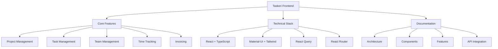

# Taskeri Frontend Documentation

## Overview
Taskeri is a comprehensive task and project management application designed to streamline workflow management for teams and organizations. The application follows a role-based access control system with three main user roles: Admin (role_id: 1), Manager (role_id: 2), and Basic User (role_id: 3).

## Core Features
- Project Management
- Task Management
- Team Management
- Company & Department Organization
- Time Tracking
- Reports and Analytics
- Leave Management
- Invoice Management
- Company Settings

## Technical Stack
- React (with TypeScript)
- Material-UI & Tailwind CSS
- React Query for data fetching
- React Router for navigation
- Context API for state management

## Documentation Structure
1. [Architecture](./Taskeri%20-%20Frontend%20Documentation/01-Architecture.md)
2. [Component Structure](./Taskeri%20-%20Frontend%20Documentation/02-Component-Structure.md)
3. [Authentication & Authorization](./Taskeri%20-%20Frontend%20Documentation/03-Authentication-Authorization.md)
4. [Features](./Taskeri%20-%20Frontend%20Documentation/04-Features.md)
5. [API Integration](./Taskeri%20-%20Frontend%20Documentation/05-API-Integration.md)
6. [State Management](./Taskeri%20-%20Frontend%20Documentation/06-State-Management.md)
7. [Styling & Theme](./Taskeri%20-%20Frontend%20Documentation/07-Styling-Theme.md)
8. [Project Structure](./Taskeri%20-%20Frontend%20Documentation/08-Project-Structure.md)

