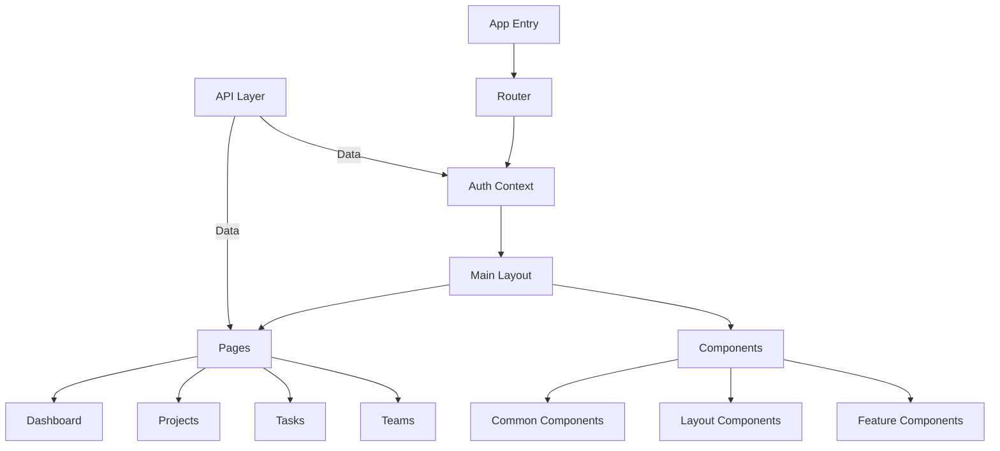
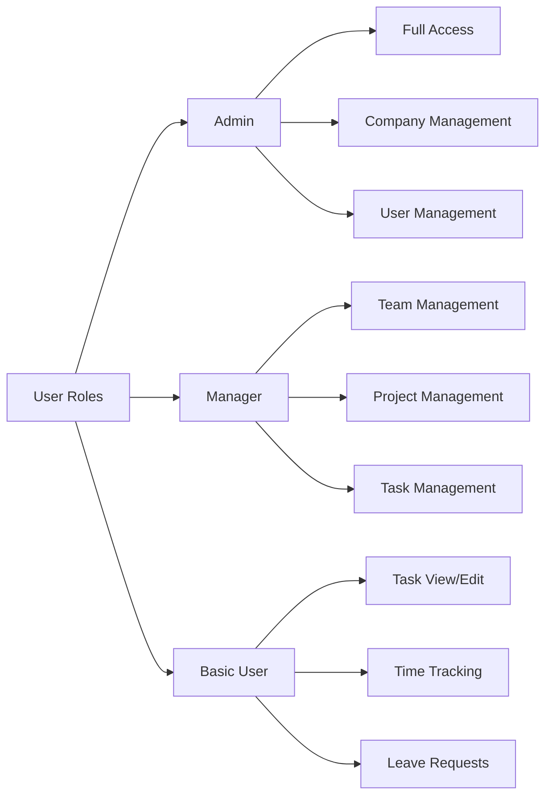
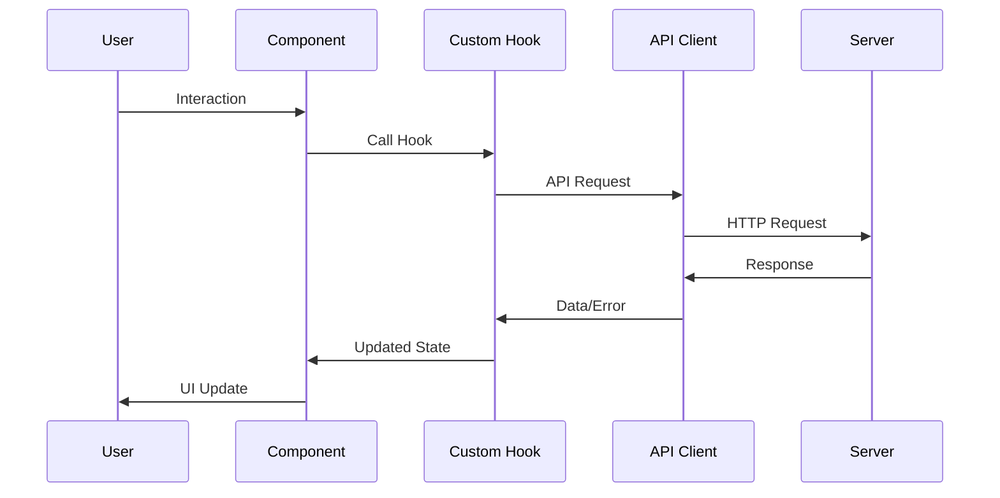

# Architecture Overview

## Application Architecture



## Directory Structure

### Core Directories
- `src/` - Application source code
  - `api/` - API integration and hooks
  - `components/` - Reusable UI components
  - `context/` - React Context providers
  - `pages/` - Application views/routes
  - `types/` - TypeScript type definitions
  - `utils/` - Utility functions and constants

### Key Architectural Decisions

1. **API Integration**
   - Centralized API client using Axios
   - Custom hooks for each API endpoint
   - TypeScript interfaces for API responses

2. **State Management**
   - React Context for global state
   - React Query for server state
   - Local state for component-specific data

3. **Routing**
   - React Router v6
   - Protected routes based on user roles
   - Nested routing for complex views

4. **Component Organization**
   ```mermaid
   graph TD
       A[Components] --> B[Common]
       A --> C[Layout]
       A --> D[Features]
       
       B --> B1[Buttons]
       B --> B2[Forms]
       B --> B3[Cards]
       
       C --> C1[Sidebar]
       C --> C2[Header]
       C --> C3[MainLayout]
       
       D --> D1[ProjectComponents]
       D --> D2[TaskComponents]
       D --> D3[TeamComponents]
   ```

## Role-based Architecture



## Data Flow

