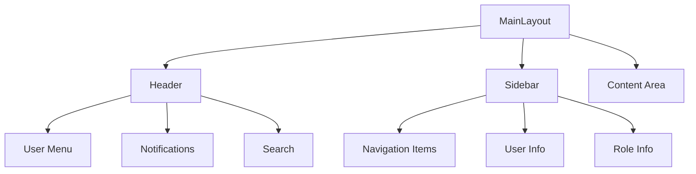
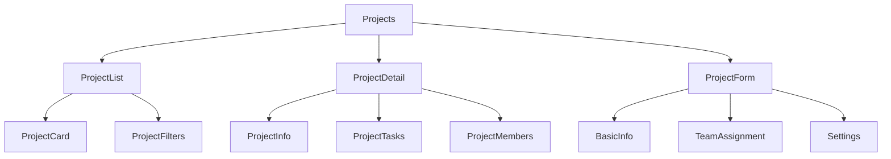
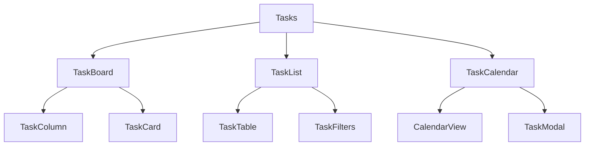
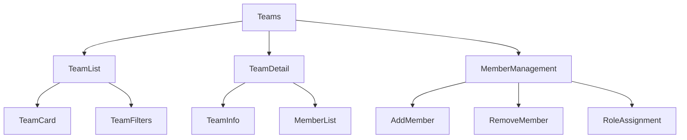
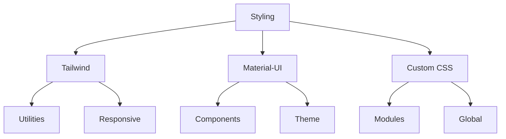

# Component Structure

## Common Components

### Layout Components
The application uses a consistent layout structure with the following key components:



### Core UI Components

#### Cards and Containers
- `Card` - Base container component
- `TabPanel` - Container for tab content
- `Modal` - Popup dialog container

#### Interactive Elements
- `Button` variants:
  - Primary
  - Secondary
  - Outline
  - Danger
- `Form` components:
  - Input fields
  - Select dropdowns
  - Date pickers
  - File uploads

#### Data Display
- `Table` - For list views
- `Grid` - For card-based layouts
- `Charts` - For data visualization
- `Badges` - For status indicators

## Feature Components

### Project Management


### Task Management


### Team Management


## Component Design Patterns

### Composition Pattern
```typescript
interface ComponentProps {
  children: React.ReactNode;
  className?: string;
  // Additional props
}

const Component: React.FC<ComponentProps> = ({
  children,
  className,
  ...props
}) => {
  return (
    <div className={className} {...props}>
      {children}
    </div>
  );
};
```

### HOC Pattern
```typescript
const withAuth = (WrappedComponent: React.ComponentType) => {
  return (props: any) => {
    const { isAuthenticated } = useAuth();
    if (!isAuthenticated) return <Navigate to="/login" />;
    return <WrappedComponent {...props} />;
  };
};
```

### Hook Pattern
```typescript
const useComponentLogic = () => {
  const [state, setState] = useState();
  const { data, isLoading } = useQuery();
  
  const handleAction = useCallback(() => {
    // Logic here
  }, []);
  
  return { state, data, isLoading, handleAction };
};
```

## Styling Approach

The application uses a combination of:
1. Tailwind CSS for utility classes
2. Material-UI for component base
3. Custom CSS modules for component-specific styling

