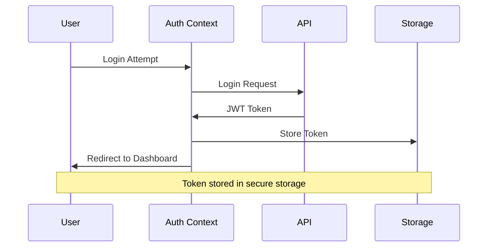
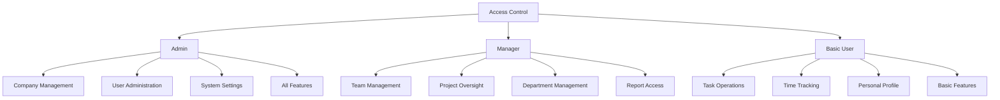
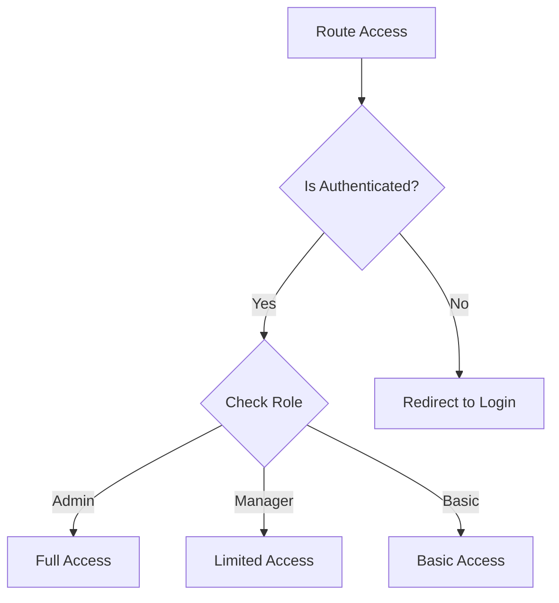
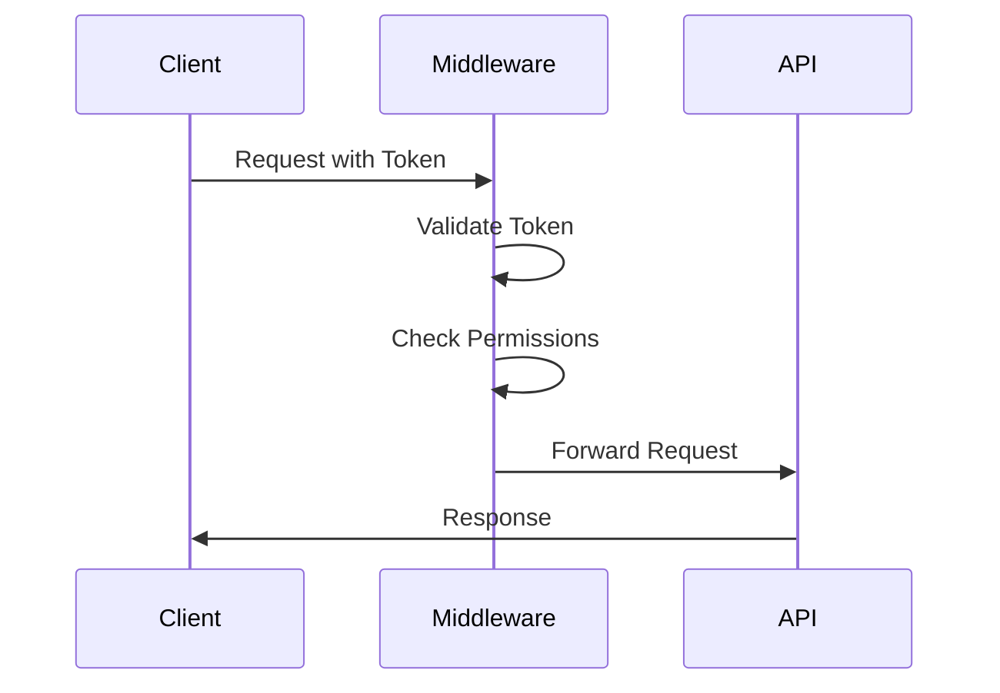
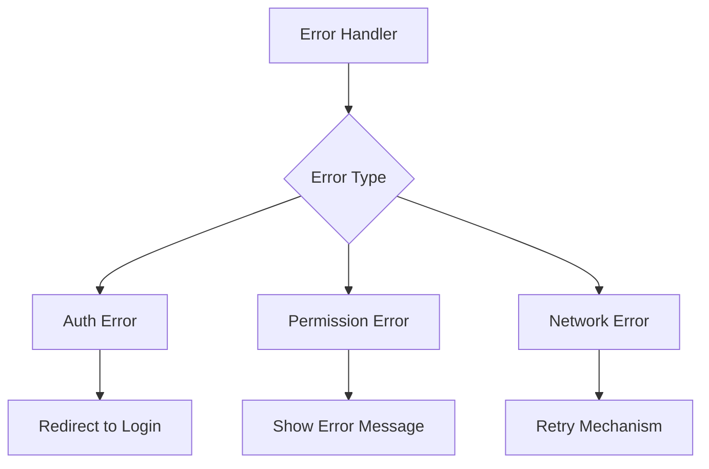

# Authentication & Authorization

## Authentication Flow



## Role-Based Access Control

### User Roles
1. **Admin (role_id: 1)**
   - Full system access
   - Company management
   - User management
   - All features available

2. **Manager (role_id: 2)**
   - Team management
   - Project management
   - Department oversight
   - Limited administrative features

3. **Basic User (role_id: 3)**
   - Task management
   - Time tracking
   - Personal dashboard
   - Limited view access



## Implementation

### Auth Context
```typescript
interface AuthContextType {
  user: User | null;
  isAuthenticated: boolean;
  login: (credentials: LoginCredentials) => Promise<void>;
  logout: () => void;
  refreshToken: () => Promise<void>;
}
```

### Protected Routes


### Permission Matrix

| Feature | Admin | Manager | Basic User |
|---------|-------|---------|------------|
| Dashboard | ✓ | ✓ | ✓ |
| Projects | ✓ | ✓ | View Only |
| Teams | ✓ | ✓ | View Only |
| Users | ✓ | ✗ | ✗ |
| Settings | ✓ | ✗ | ✗ |
| Tasks | ✓ | ✓ | ✓ |
| Time Tracking | ✓ | ✓ | ✓ |
| Reports | ✓ | ✓ | Self Only |
| Invoices | ✓ | ✗ | ✗ |

## Security Measures

### Token Management
1. JWT Token Storage
2. Token Refresh Mechanism
3. Secure Headers

### API Security
1. Request Authentication
2. CORS Configuration
3. Rate Limiting



## Error Handling

### Authentication Errors
- Invalid credentials
- Token expiration
- Unauthorized access

### Authorization Errors
- Insufficient permissions
- Role-based restrictions
- Feature access denial

