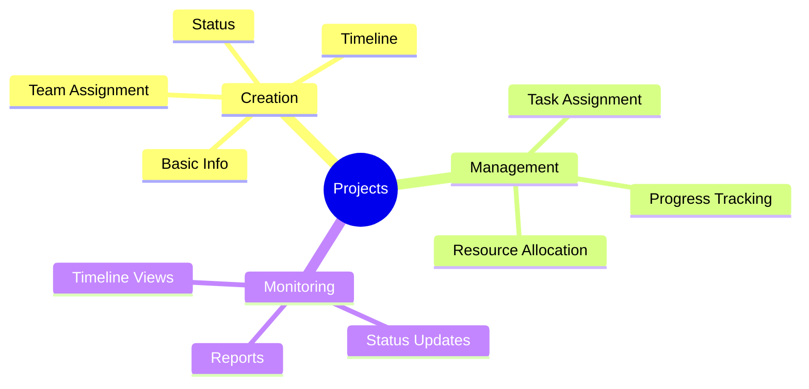
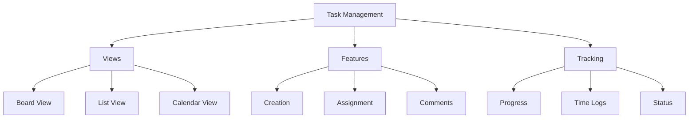
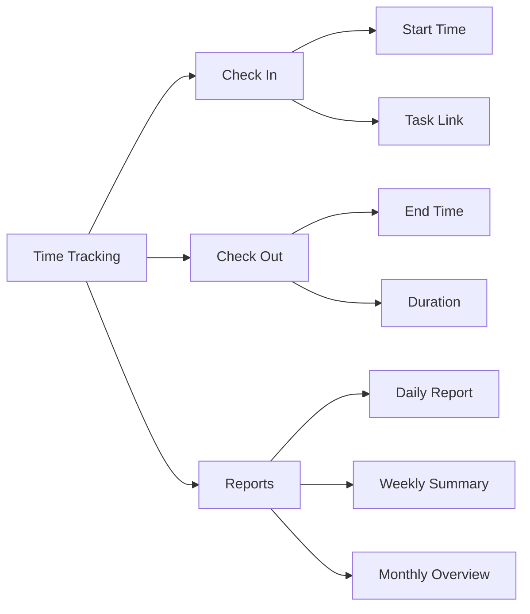
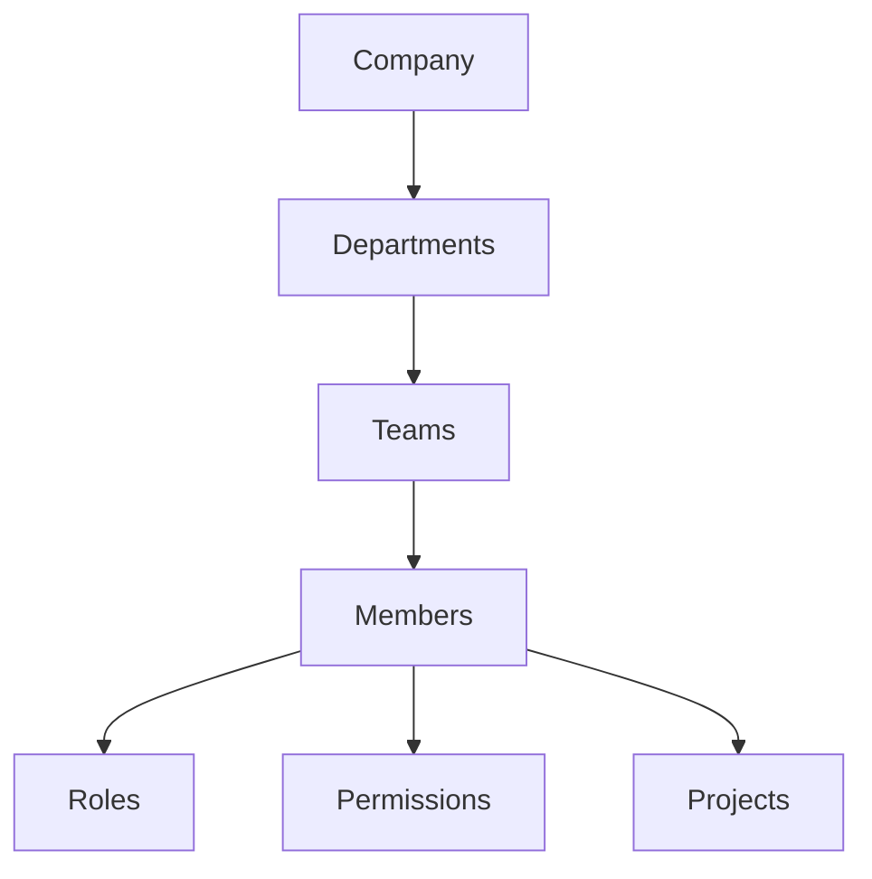
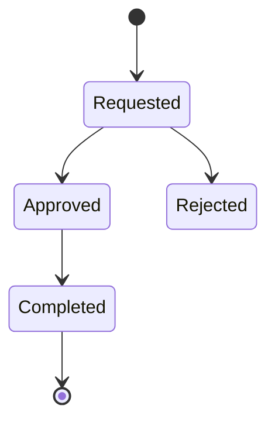
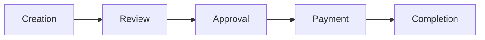
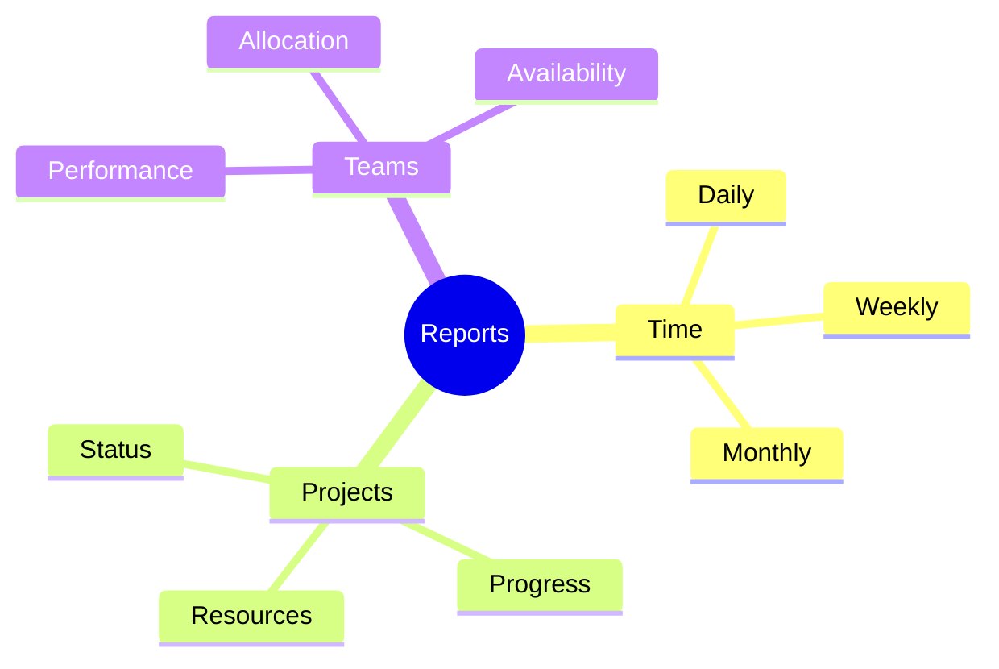
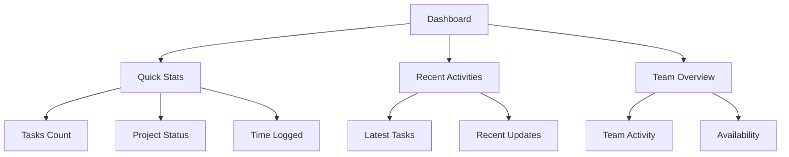
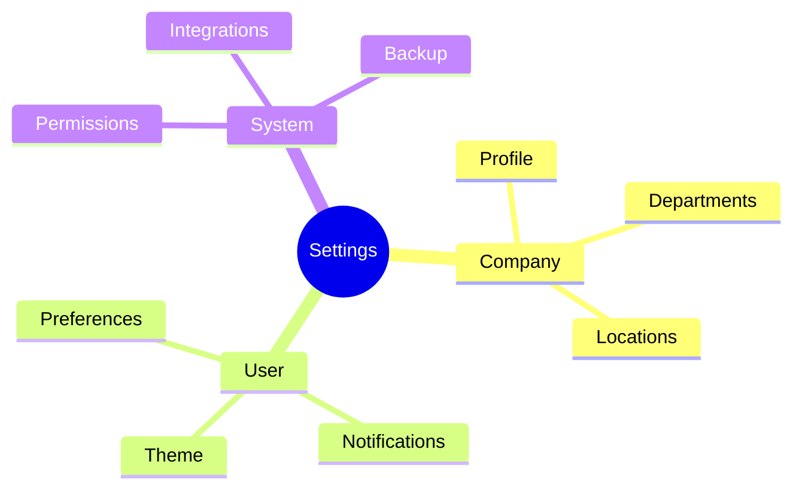
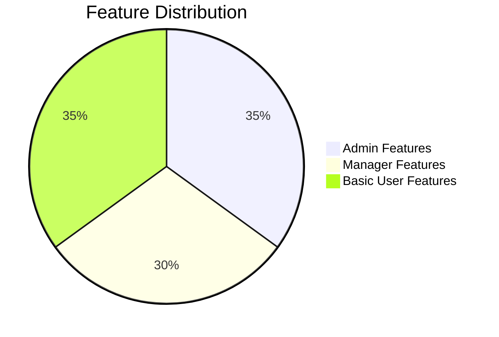

# Features Overview

## Project Management

### Project Workflow
1. Project Creation
2. Team Assignment
3. Task Creation
4. Progress Tracking
5. Completion & Review

## Task Management

### Task States
- Todo
- In Progress
- Technical Review
- Done

## Time Tracking

## Team Management

### Team Structure

## Leave Management

## Invoice Management

### Invoice Workflow

## Reporting System

### Report Types

## Dashboard

### Dashboard Components

## Settings Management

### Configuration Areas

## Key Features by Role

### Admin Features
- Company Management
- User Administration
- System Configuration
- Report Generation
- Invoice Management

### Manager Features
- Team Management
- Project Oversight
- Task Assignment
- Performance Monitoring
- Time Approval

### Basic User Features
- Task Management
- Time Tracking
- Leave Requests
- Personal Dashboard
- Profile Management

