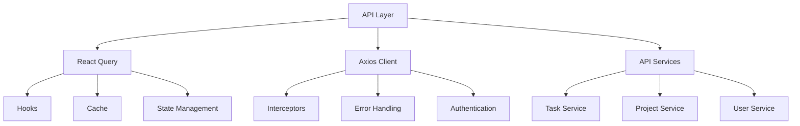
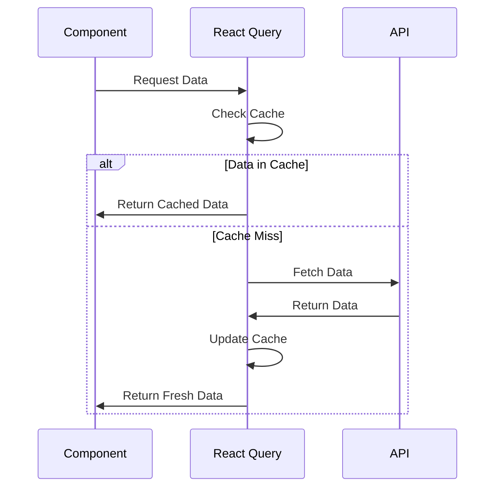
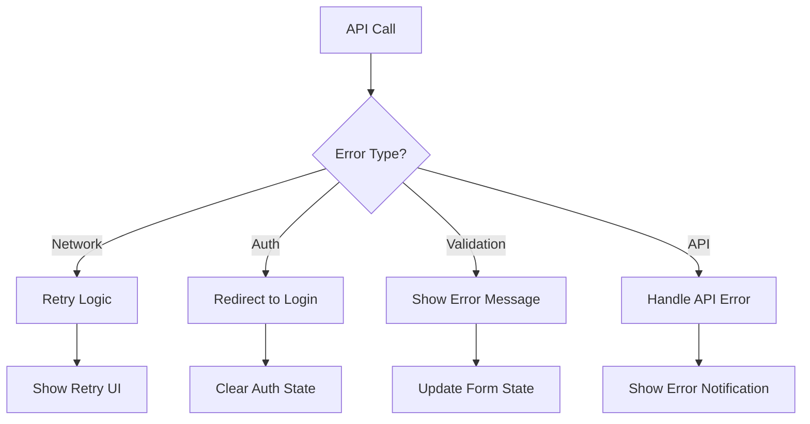
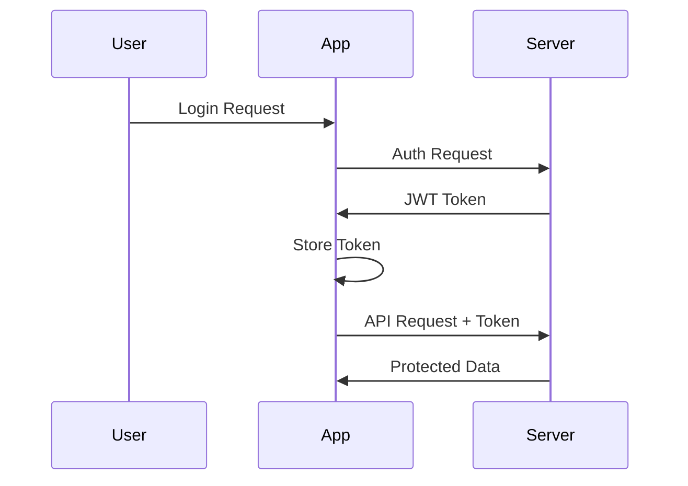

# API Integration

## Overview

The application uses a robust API integration layer built with React Query and Axios. This ensures efficient data fetching, caching, and state management for all API calls.



## API Structure

### Service Layer Organization
```
api/
├── apiClient.ts        # Base Axios configuration
├── endpoints.ts        # API endpoint definitions
├── hooks/             # React Query hooks
└── services/          # API service implementations
```

## Core API Services

### Task Management
- `getTasks()` - Fetch paginated tasks
- `getTaskById()` - Get single task details
- `createTask()` - Create new task
- `updateTask()` - Update existing task
- `deleteTask()` - Delete task

### Project Management
- `getProjects()` - Fetch all projects
- `getProjectById()` - Get project details
- `createProject()` - Create new project
- `updateProject()` - Update project
- `deleteProject()` - Delete project

### User Management
- `getUsers()` - Fetch all users
- `getUserById()` - Get user details
- `createUser()` - Create new user
- `updateUser()` - Update user
- `deleteUser()` - Delete user

## React Query Implementation

### Example Hook Implementation
```typescript
export const useTasks = (params?: TaskFilterParams) => {
  return useQuery({
    queryKey: ['tasks', params],
    queryFn: () => getTasks(params),
    staleTime: 5 * 60 * 1000, // 5 minutes
  });
};
```

### Cache Management


## Error Handling

### Error Types
1. API Errors
2. Network Errors
3. Validation Errors
4. Authentication Errors

### Error Handling Flow


## Authentication

### JWT Token Management
- Token storage in secure localStorage
- Automatic token refresh
- Token inclusion in requests
- Token validation

### Auth Flow


## API Endpoint Configuration

### Endpoint Structure
```typescript
export const API_ENDPOINTS = {
  AUTH: {
    LOGIN: '/auth/login',
    REFRESH: '/auth/refresh',
    LOGOUT: '/auth/logout',
  },
  TASKS: {
    BASE: '/tasks',
    DETAIL: (id: number) => `/tasks/${id}`,
  },
  // ... other endpoints
};
```

## Data Fetching Strategies

### Optimistic Updates
For better user experience, the application implements optimistic updates for:
- Task status changes
- Task assignments
- Comments
- Project updates

### Example Optimistic Update
```typescript
const updateTask = useMutation({
  mutationFn: (data: TaskUpdate) => updateTaskApi(data),
  onMutate: async (newData) => {
    await queryClient.cancelQueries(['task', newData.id]);
    const previousData = queryClient.getQueryData(['task', newData.id]);
    queryClient.setQueryData(['task', newData.id], newData);
    return { previousData };
  },
  onError: (err, newData, context) => {
    queryClient.setQueryData(
      ['task', newData.id],
      context?.previousData
    );
  },
});
```