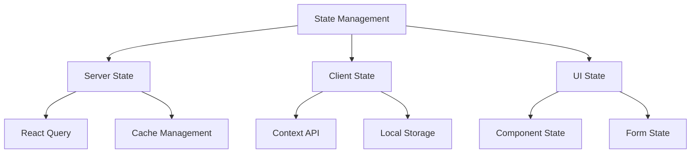
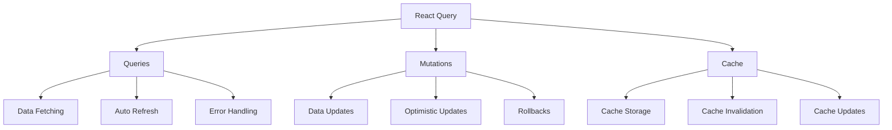
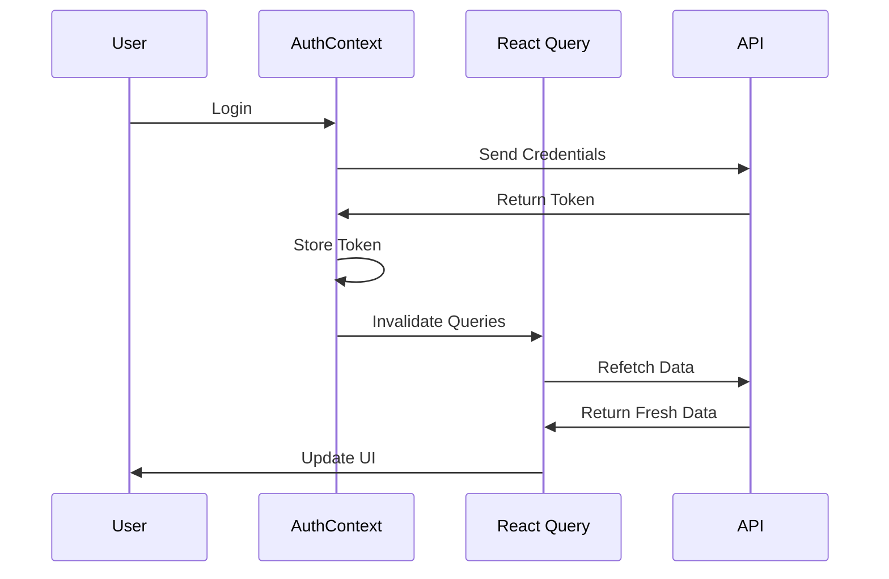
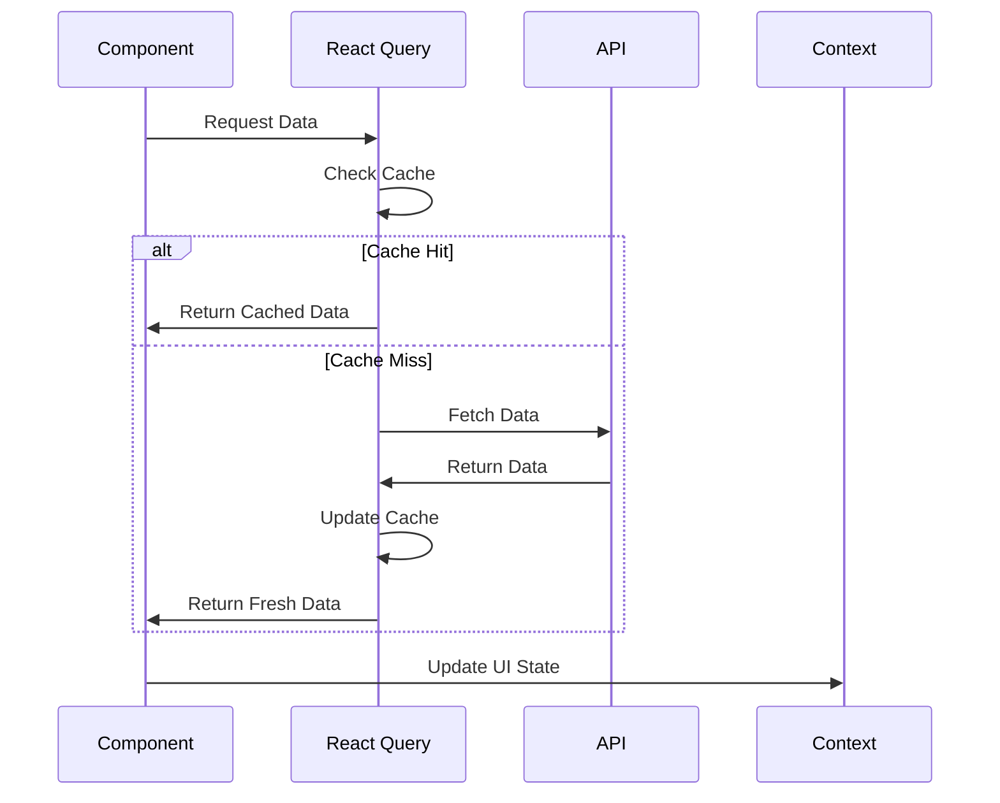

# State Management

## Overview

Taskeri uses a combination of Context API and React Query for state management. This hybrid approach allows for efficient handling of both server and client state.



## Context Management

### Available Contexts

1. **AuthContext**
```typescript
interface AuthContextType {
  user: User | null;
  isAuthenticated: boolean;
  login: (credentials: LoginCredentials) => Promise<void>;
  logout: () => void;
  refreshToken: () => Promise<void>;
}
```

2. **RoleContext**
```typescript
interface RoleContextType {
  roles: Role[];
  userRole: Role | null;
  getRoleName: (roleId: number) => string;
  hasPermission: (permission: string) => boolean;
}
```

3. **NotificationContext**
```typescript
interface NotificationContextType {
  showNotification: (type: NotificationType, title: string, message: string) => void;
  hideNotification: () => void;
}
```

4. **ThemeContext**
```typescript
interface ThemeContextType {
  theme: Theme;
  toggleTheme: () => void;
}
```

## State Organization

### Server State (React Query)


### Local State Management

#### Component-Level State
- Form state
- UI interactions
- Loading states
- Error states

#### Application-Level State
- Authentication state
- User preferences
- Theme settings
- Role-based permissions

## State Flow Patterns

### Authentication Flow


### Data Management Flow


## Best Practices

### State Updates
1. **Atomic Updates**
   - Update smallest possible state unit
   - Avoid nested state updates
   - Use immutable update patterns

2. **Optimistic Updates**
   - Update UI immediately
   - Rollback on error
   - Show loading states

3. **Cache Management**
   - Define appropriate stale times
   - Implement cache invalidation
   - Handle cache updates

### Example Implementation

```typescript
// Task list with optimistic updates
export const useTaskList = () => {
  const queryClient = useQueryClient();

  const { data: tasks } = useQuery({
    queryKey: ['tasks'],
    queryFn: getTasks,
  });

  const updateTask = useMutation({
    mutationFn: updateTaskApi,
    onMutate: async (newTask) => {
      await queryClient.cancelQueries(['tasks']);
      const previousTasks = queryClient.getQueryData(['tasks']);
      
      queryClient.setQueryData(['tasks'], (old: Task[]) =>
        old.map(task => 
          task.id === newTask.id ? { ...task, ...newTask } : task
        )
      );
      
      return { previousTasks };
    },
    onError: (err, newTask, context) => {
      queryClient.setQueryData(['tasks'], context?.previousTasks);
    },
    onSettled: () => {
      queryClient.invalidateQueries(['tasks']);
    },
  });

  return { tasks, updateTask };
};
```