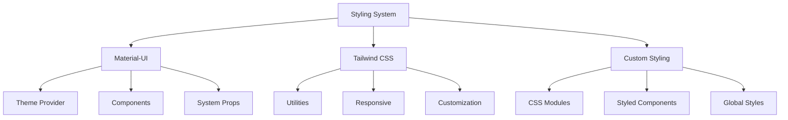
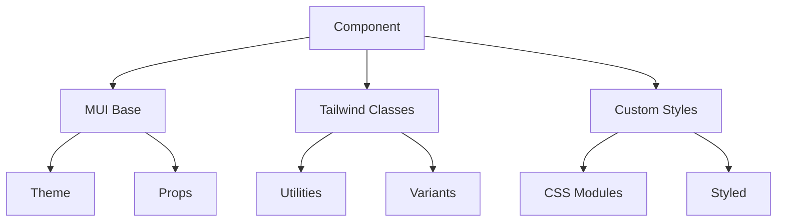
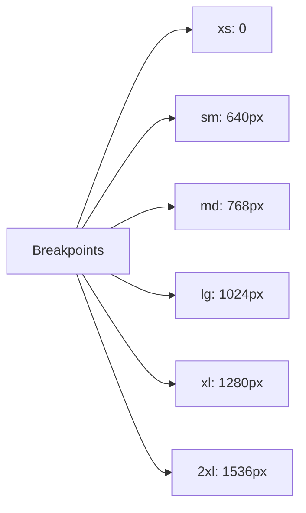

# Styling & Theme System

## Overview

Taskeri implements a hybrid styling approach combining Material-UI's theming system with Tailwind CSS utilities for maximum flexibility and consistency.



## Theme Configuration

### Material-UI Theme
```typescript
const theme = createTheme({
  palette: {
    primary: {
      main: '#0EA5E9',
      light: '#7DD3FC',
      dark: '#0369A1',
    },
    secondary: {
      main: '#6366F1',
      light: '#A5B4FC',
      dark: '#4338CA',
    },
    background: {
      default: '#F8FAFC',
      paper: '#FFFFFF',
    },
    text: {
      primary: '#1E293B',
      secondary: '#64748B',
    },
  },
  typography: {
    fontFamily: '"Inter", "Helvetica", "Arial", sans-serif',
    h1: { fontWeight: 700 },
    h2: { fontWeight: 600 },
    h3: { fontWeight: 600 },
    h4: { fontWeight: 600 },
    h5: { fontWeight: 500 },
    h6: { fontWeight: 500 },
  },
});
```

### Tailwind Configuration
```javascript
module.exports = {
  content: ['./src/**/*.{js,jsx,ts,tsx}'],
  theme: {
    extend: {
      colors: {
        primary: {
          50: '#F0F9FF',
          100: '#E0F2FE',
          500: '#0EA5E9',
          600: '#0284C7',
          700: '#0369A1',
        },
        secondary: {
          50: '#EEF2FF',
          100: '#E0E7FF',
          500: '#6366F1',
          600: '#4F46E5',
          700: '#4338CA',
        },
      },
    },
  },
  plugins: [],
};
```

## Component Styling Strategy

### Base Components


### Example Component Implementation
```typescript
const Card = styled(MuiCard)(({ theme }) => ({
  borderRadius: theme.spacing(2),
  transition: 'all 0.3s ease-in-out',
  '&:hover': {
    transform: 'translateY(-4px)',
    boxShadow: theme.shadows[4],
  },
  [theme.breakpoints.down('sm')]: {
    borderRadius: theme.spacing(1),
  },
}));
```

## Responsive Design

### Breakpoint System


### Media Query Usage
1. **Material-UI**
```typescript
const Component = styled('div')(({ theme }) => ({
  [theme.breakpoints.up('sm')]: {
    display: 'flex',
  },
  [theme.breakpoints.down('md')]: {
    flexDirection: 'column',
  },
}));
```

2. **Tailwind CSS**
```html
<div class="
  flex-col 
  sm:flex-row 
  md:items-center 
  lg:justify-between
">
  <!-- Content -->
</div>
```

## Animation System

### Framer Motion Integration
```typescript
const containerVariants = {
  hidden: { opacity: 0 },
  visible: {
    opacity: 1,
    transition: {
      staggerChildren: 0.1,
    },
  },
};

const itemVariants = {
  hidden: { y: 20, opacity: 0 },
  visible: { y: 0, opacity: 1 },
};
```

### Transition System
```scss
// Common transitions
.transition-base {
  @apply transition-all duration-200 ease-in-out;
}

.transition-smooth {
  @apply transition-all duration-300 ease-in-out;
}

.transition-slow {
  @apply transition-all duration-500 ease-in-out;
}
```

## Dark Mode Support

### Theme Toggle Implementation
```typescript
const ThemeProvider: React.FC = ({ children }) => {
  const [isDarkMode, setIsDarkMode] = useState(false);
  
  const theme = createTheme({
    palette: {
      mode: isDarkMode ? 'dark' : 'light',
      // Theme configuration
    },
  });

  return (
    <MUIThemeProvider theme={theme}>
      <div className={isDarkMode ? 'dark' : ''}>
        {children}
      </div>
    </MUIThemeProvider>
  );
};
```

### Dark Mode Classes
```scss
// Dark mode variants
.dark {
  @apply bg-gray-900 text-white;
  
  .card {
    @apply bg-gray-800 border-gray-700;
  }
  
  .text-primary {
    @apply text-blue-400;
  }
  
  .bg-surface {
    @apply bg-gray-800;
  }
}
```

## CSS Architecture

### File Structure
```
styles/
├── global.css        # Global styles
├── theme.ts         # Theme configuration
├── variables.css    # CSS variables
└── components/      # Component-specific styles
    ├── Button.module.css
    ├── Card.module.css
    └── Form.module.css
```

### Best Practices
1. **Component Isolation**
   - Use CSS Modules for component-specific styles
   - Implement BEM methodology where appropriate
   - Maintain clear separation of concerns

2. **Performance**
   - Minimize CSS bundle size
   - Use efficient selectors
   - Implement code splitting

3. **Maintenance**
   - Follow consistent naming conventions
   - Document complex styles
   - Use CSS variables for common values