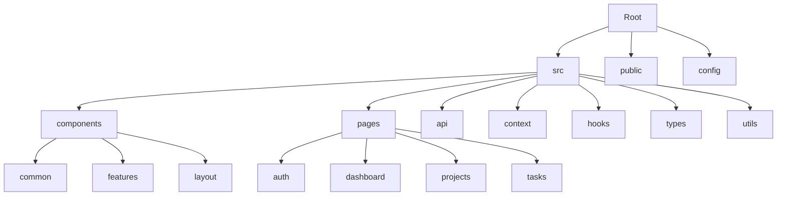
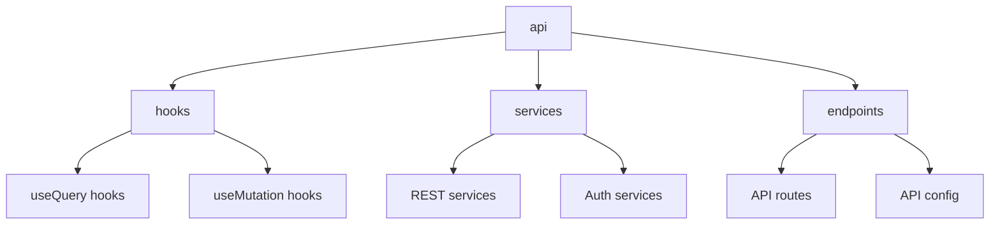

# Project Structure & Organization

## Directory Overview



## Core Directories

### Source Structure
```
src/
├── api/              # API integration
├── components/       # Reusable components
├── context/         # React Context providers
├── hooks/           # Custom hooks
├── pages/           # Page components
├── routes/          # Routing configuration
├── styles/          # Global styles
├── types/           # TypeScript definitions
└── utils/           # Utility functions
```

## Component Organization

### Component Categories

1. **Common Components**
```
components/common/
├── Button/
├── Card/
├── Input/
├── Modal/
└── Table/
```

2. **Feature Components**
```
components/features/
├── ProjectList/
├── TaskBoard/
├── TeamMembers/
└── TimeTracking/
```

3. **Layout Components**
```
components/layout/
├── Sidebar/
├── Header/
├── Footer/
└── MainLayout/
```

## Page Structure

### Page Organization
```
pages/
├── auth/
│   ├── Login.tsx
│   ├── Register.tsx
│   └── ForgotPassword.tsx
├── dashboard/
│   └── Dashboard.tsx
├── projects/
│   ├── ProjectList.tsx
│   ├── ProjectDetail.tsx
│   └── ProjectForm.tsx
└── tasks/
    ├── TaskBoard.tsx
    ├── TaskList.tsx
    └── TaskDetail.tsx
```

## API Integration Structure

### API Organization


## Type System

### Type Organization
```
types/
├── api.types.ts
├── auth.types.ts
├── project.types.ts
├── task.types.ts
├── team.types.ts
└── user.types.ts
```

## Configuration Files

### Root Level Configuration
```
├── package.json
├── tsconfig.json
├── tailwind.config.js
└── postcss.config.js
```

## Route Structure

### Route Organization
```typescript
const routes = {
  // Auth routes
  auth: {
    login: '/login',
    register: '/register',
    forgotPassword: '/forgot-password',
  },
  
  // Main routes
  dashboard: '/',
  projects: '/projects',
  tasks: '/tasks',
  teams: '/teams',
  
  // Feature routes
  settings: '/settings',
  profile: '/profile',
};
```

## Code Organization Best Practices

### File Naming Conventions
1. **Components**: PascalCase
   - `Button.tsx`
   - `TaskList.tsx`
   - `UserProfile.tsx`

2. **Utilities**: camelCase
   - `formatDate.ts`
   - `validateInput.ts`
   - `calculateTotal.ts`

3. **Constants**: UPPER_CASE
   - `API_ENDPOINTS.ts`
   - `ROLE_TYPES.ts`
   - `STATUS_CODES.ts`

### Import Organization
```typescript
// External imports
import React from 'react';
import { useQuery } from '@tanstack/react-query';

// Internal imports - components
import { Button } from '@/components/common';
import { TaskCard } from '@/components/features';

// Internal imports - hooks & utils
import { useAuth } from '@/hooks';
import { formatDate } from '@/utils';

// Types
import { Task } from '@/types';
```

## Development Guidelines

### Code Structure
1. **Component Structure**
```typescript
// Imports
// Types
// Constants
// Component
// Exports
```

2. **Hook Structure**
```typescript
// Dependencies
// State
// Effects
// Handlers
// Return
```

3. **Context Structure**
```typescript
// Context creation
// Provider implementation
// Hook creation
// Exports
```

## Testing Organization

### Test Structure
```
__tests__/
├── components/
│   ├── Button.test.tsx
│   └── Card.test.tsx
├── hooks/
│   ├── useAuth.test.ts
│   └── useForm.test.ts
└── utils/
    ├── format.test.ts
    └── validate.test.ts
```

## Asset Management

### Asset Organization
```
assets/
├── images/
│   ├── logos/
│   └── icons/
├── fonts/
│   ├── inter/
│   └── roboto/
└── styles/
    ├── variables/
    └── themes/
```

## Environment Configuration

### Environment Files
```
.env.development
.env.production
.env.test
```

## Build Configuration

### Build Structure
```
build/
├── static/
│   ├── css/
│   ├── js/
│   └── media/
└── index.html
```

## Version Control

### Git Structure
```
.gitignore
.gitattributes
.github/
└── workflows/
    └── ci.yml
```